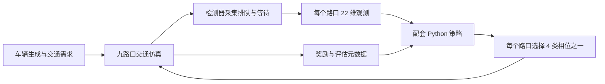

# Traffic-ML-MAPPO

**面向潮汐车流的多路口交通仿真与强化学习控制 · SW-TA-GAT-MAPPO**

基于 Unity 与 ML-Agents 构建的 3×3 九路口交通仿真环境，围绕车辆生成、跨路口行驶、交通状态采集、信号相位控制和算法交互，形成交通信号控制的完整仿真闭环。

项目对应研究方向为**基于状态加权与交通流感知图注意力的多智能体交通信号控制**。配套算法采用 SW-TA-GAT-MAPPO，将路口之间的空间关联、动态交通压力和策略训练结合起来。本仓库承载其中的 **Unity 仿真环境、C# 控制逻辑与 ML-Agents 接口**。

`Unity` · `C#` · `ML-Agents` · `多智能体强化学习` · `交通仿真` · `图注意力`

## 项目亮点

- **九路口协同控制**：每个十字路口对应一个信号控制智能体，通过路网连接形成相互影响的交通环境。
- **车辆行为仿真**：支持车辆生成、路径分配、跨路口行驶、转向、跟驰、红灯停车与出口回收。
- **动态交通需求**：提供均匀车流和方向性潮汐场景，通过入口发车间隔模拟交通压力变化与恢复过程。
- **标准化决策接口**：每个路口输出 22 维观测，接收 4 类离散相位动作，供外部策略训练与推理使用。
- **多目标奖励设计**：结合通行奖励、排队惩罚、等待惩罚、溢出惩罚和相位切换惩罚。
- **可追踪的实验环境**：支持固定随机种子，并通过 Side Channel 输出场景阶段、潮汐方向及受影响入口等评估元数据。

## 系统工作流程

Unity 负责交通状态演化和动作执行；配套 Python 算法负责拓扑排序、图特征融合与策略更新。策略动作按智能体映射关系返回对应路口，保持观测、动作与奖励的一致性。

## 交通仿真功能

| 模块 | 实现内容 |
| --- | --- |
| 路网与路径 | 3×3 十字路口布局，通过路线配置和路口触发器组织车辆行驶 |
| 车辆控制 | 基于位置与朝向更新运动，结合前向检测完成跟驰和安全距离控制 |
| 信号响应 | 根据信号灯状态停车、放行，并与转向路径衔接 |
| 交通检测 | 每个路口设置 8 个检测方向，采集排队数量、等待状态与车流密度 |
| 场景调度 | 均匀车流、方向性潮汐扰动与恢复阶段，支持入口分组控制 |
| 回合管理 | 清理车辆、重置检测器与信号相位、重新初始化交通需求 |
| 数据通信 | ML-Agents 传递观测、动作与奖励，Side Channel 传递评估元数据 |

## 观测、动作与奖励

### 22 维路口观测

| 组成 | 维度 | 含义 |
| --- | ---: | --- |
| 路口坐标 | 2 | 归一化后的 `gridX`、`gridZ` |
| 排队状态 | 8 | 北、南、东、西方向的直行与左转检测量 |
| 等待状态 | 8 | 与上述车道顺序对应的归一化等待量 |
| 当前相位 | 4 | 当前信号相位的独热编码 |
| **合计** | **22** | 单个智能体的状态输入 |

全网观测可组织为 `[9, 22]`。配套算法根据路口坐标建立拓扑顺序，使图节点和实际路口对应。

### 4 类离散动作

| 动作编号 | 放行相位 |
| ---: | --- |
| 0 | 南北直行与右转 |
| 1 | 东西直行与右转 |
| 2 | 南北左转 |
| 3 | 东西左转 |

### 奖励设计

奖励综合考虑车辆通行效率与拥堵状态：车辆通过时提供正向反馈，排队和等待产生惩罚；排队超过阈值时增加溢出惩罚，相位变更时加入切换惩罚。各项参数可在 Inspector 中配置。

## 配套研究方法：SW-TA-GAT-MAPPO

算法层以图注意力与多智能体策略优化为基础，引入两个互补模块：

| 模块 | 作用位置 | 核心思路 |
| --- | --- | --- |
| GAT | 路口特征融合 | 沿道路拓扑融合自身与相邻路口的信息 |
| TA：交通流感知 | 图注意力计算 | 将目标路口的排队与等待压力作为动态边特征，引入 `GATv2` 注意力计算 |
| SW：状态加权 | 策略更新 | 比较同一时刻各路口的交通压力，以 Softmax 和残差混合生成权重，加权优势值后参与 PPO 策略损失 |
| MAPPO | 多智能体学习 | 基于 Actor-Critic 与策略裁剪目标学习路口相位决策 |

TA 关注**如何表达与融合交通状态**，SW 关注**不同路口经验在训练中的贡献**。配套算法使用 Python、PyTorch 与 PyTorch Geometric，通过 ML-Agents 与本仓库的仿真环境连接。

研究评估覆盖均匀、潮汐及恢复阶段，围绕全网排队、车道等待、高排队车道和恢复过程展开，并与 GAT-MAPPO、IPPO、固定配时方法进行对比。固定种子与重复评估用于统一交通需求和统计口径。

## 运行环境与启动

| 项目 | 配置 |
| --- | --- |
| Unity 编辑器 | `2022.3.57f1c1` |
| 主要语言 | C# |
| 强化学习接口 | ML-Agents `2.3.0-exp.3` |
| 主场景 | `Assets/Scenes/Traffic-Scene.unity` |

1. 克隆仓库，在 Unity Hub 中添加工程根目录。
2. 使用对应 Unity 版本打开工程，完成资源导入。
3. 在 Package Manager 中配置 ML-Agents。工程使用本地包引用，可通过 **Add package from disk** 选择匹配版本的 `package.json`，使依赖路径对应本机安装位置。
4. 打开 `Traffic-Scene`，在 `TrafficScenarioManager` 中选择交通场景和种子设置。
5. 本地观察车辆与相位时，可将智能体的 Behavior Type 设置为 `Heuristic Only`，使用数字键 `1`～`4` 切换相位。
6. 对接配套 Python 算法时，将 Behavior Type 设置为 `Default`，通过 ML-Agents 连接编辑器或构建后的可执行环境，由策略端控制各路口。

Python 接入时需保持每智能体 22 维观测、单分支 4 类离散动作，以及按坐标进行的路口排序和动作反映射。Side Channel 的频道标识与字段顺序见对应 C# 脚本。

[`config/traffic.yaml`](config/traffic.yaml) 提供 ML-Agents PPO 配置示例；SW-TA-GAT-MAPPO 的训练与评估由配套 Python 算法工程组织。

## 核心代码导航

| 文件 | 职责 |
| --- | --- |
| [`TrafficSignalAgent.cs`](Assets/Scripts/TrafficSignalAgent.cs) | 观测采集、动作执行、相位控制与奖励计算 |
| [`TrafficScenarioManager.cs`](Assets/Scripts/TrafficScenarioManager.cs) | 交通场景、潮汐调度、种子及回合状态管理 |
| [`TrafficSpawner.cs`](Assets/Scripts/TrafficSpawner.cs) | 车辆生成与入口需求控制 |
| [`CarController.cs`](Assets/Scripts/CarController.cs) | 车辆运动、跟驰、停车与路径衔接 |
| [`QueueDetector.cs`](Assets/Scripts/QueueDetector.cs) | 排队、等待与密度检测 |
| [`IntersectionTrigger.cs`](Assets/Scripts/IntersectionTrigger.cs) | 路口触发与车辆路径分配 |
| [`RouteConfig.cs`](Assets/Scripts/RouteConfig.cs) | 行驶路线配置 |
| [`TrafficSink.cs`](Assets/Scripts/TrafficSink.cs) | 出口车辆回收 |
| [`TrafficTelemetrySideChannel.cs`](Assets/Scripts/TrafficTelemetrySideChannel.cs) | 评估元数据通信协议 |

<!-- 展示素材上传后，可在简介下插入路网全景、潮汐运行视频与实验结果图。 -->
